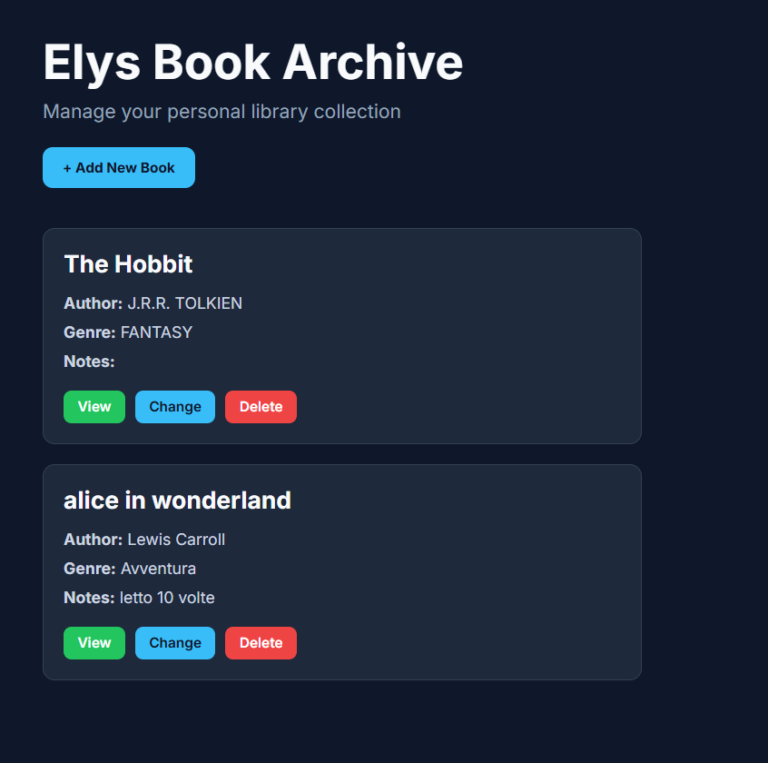
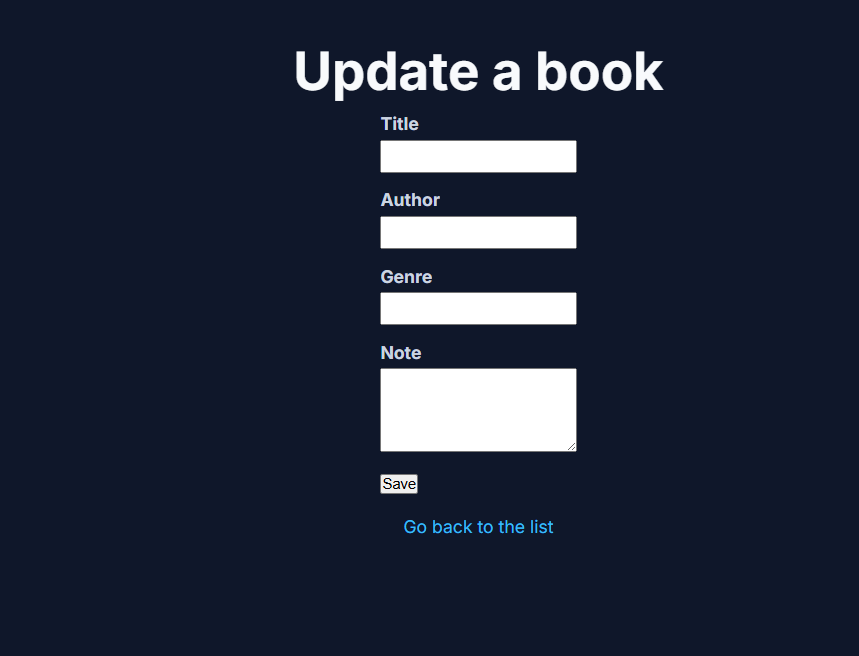

# Elys Book Archive

A PHP and MySQL CRUD application designed to manage a personal book collection.

This project was developed to practice backend development fundamentals, database management and server-side logic using PHP and MySQL.

---

## Features

✅ Create new books

✅ View all books

✅ View book details

✅ Edit existing books

✅ Delete books with confirmation

✅ MySQL database integration

✅ Responsive dark-themed interface

---

## Tech Stack

- PHP
- MySQL
- HTML5
- CSS3
- Git
- GitHub
- MAMP

---

## Project Structure

```txt
elys-book-archive
│
├── index.php
├── create.php
├── store.php
├── show.php
├── edit.php
├── update.php
├── delete.php
├── database.php
├── style.css
├── database.sql
│
└── screenshots
    ├── home.png
    ├── create.png
    ├── show.png
    └── edit.png
```

---

## Screenshots

### Home Page



### Add New Book


### Edit Book



---

## Installation

1. Clone the repository

```bash
git clone https://github.com/TUO-USERNAME/elys-book-archive.git
```

2. Move the project inside:

```txt
C:\MAMP\htdocs
```

3. Create a MySQL database named:

```txt
elys_book_archive
```

4. Import the database.sql file into your MySQL database

5. Start Apache and MySQL from MAMP

6. Open:

```txt
http://localhost:8888/elys-book-archive/index.php
```


---

## Future Improvements

- Search books by title
- Category filtering
- User authentication
- Pagination
- Custom modal windows
- Online deployment

---

## Author

Alice Pisciuneri

Frontend Developer & Digital Content Creator